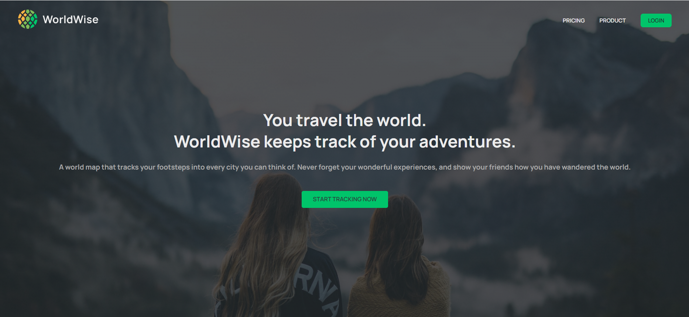
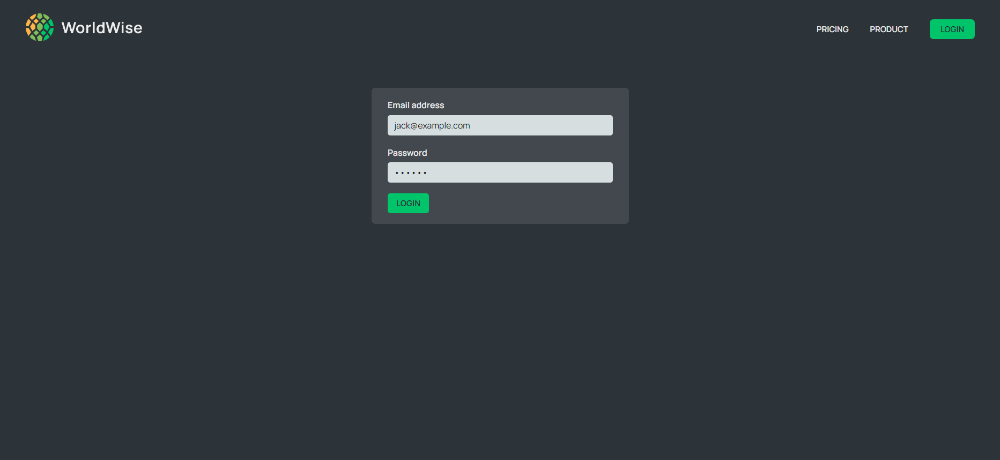
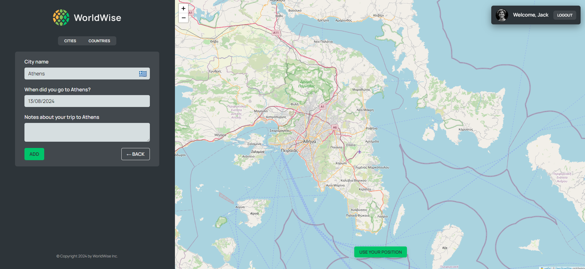
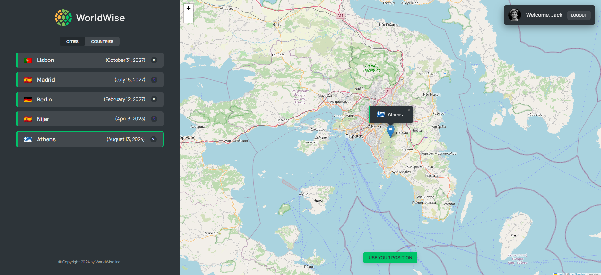

#  

## 🌟 Features

- **Interactive Map**: Explore cities around the world using an interactive map with Leaflet.
- **City and Country Listings**: View and manage lists of visited cities and countries.
- **User Authentication**: Secure routes with authentication using a simple fake auth context.
- **City Details and Notes**: Store and retrieve details, including personal notes, about your visits to various cities.
- **Lazy Loading**: Efficiently load components with React's lazy and suspense.

## 🛠️ Technologies Used

- **Frontend**:
  - [React](https://reactjs.org/)
  - [React Router](https://reactrouter.com/)
  - [React Leaflet](https://react-leaflet.js.org/)
  - [Vite](https://vitejs.dev/)
  - [React Datepicker](https://reactdatepicker.com/)

- **Backend**:
  - [JSON Server](https://github.com/typicode/json-server)

## 🚀 Getting Started
 
### 🟢 Prerequisites

- Node.js (v14 or higher)
- npm (v6 or higher)

### 🟢 Installation

1. **Clone the repository**:

   
 ```bash
   git clone https://github.com/KarimAdel-1/worldwise.git
   cd worldwise
 ```

2. **Install dependencies**:

   
 ```bash
   npm install
 ```

3. **Start the development server**:

   
 ```bash
   npm run dev
 ```

4. **Start the JSON server** (for backend data):

   
 ```bash
   npm run server
 ```

5. **Build the project**:

   
 ```bash
   npm run build
 ```

6. **Preview the production build**:

   
 ```bash
   npm run preview
 ```

## 👌 Usage

- **Homepage**: Browse the homepage and navigate to other sections such as Product, Pricing, and Login.
- **Map Interaction**: Click on the map to select cities and add them to your visited list.
- **City Management**: Use forms to add notes, dates, and other details for each city.
- **User Authentication**: Login to access protected routes and manage your visited cities and countries.

## 🖼️ Screenshots

### Homepage


### Login Page


### Interactive Map


### Adding City


## 📦 Project Structure

- **components/**: Reusable React components.
- **pages/**: Different pages of the application (e.g., Homepage, Product, Pricing).
- **contexts/**: Context providers for state management.
- **hooks/**: Custom hooks for various functionalities.
- **styles/**: CSS modules for component-specific styles.
- **data/**: JSON files and server-related data.
- **App.js**: Main application component with route definitions.
- **index.js**: Entry point of the application.

## 🤝 Contributing

Contributions are welcome! Please feel free to submit a Pull Request.

## 💬 Acknowledgements

- [OpenStreetMap](https://www.openstreetmap.org/) for map tiles.
- [Flag CDN](https://flagcdn.com) for country flags.
- [React Leaflet](https://react-leaflet.js.org/) for map components.
